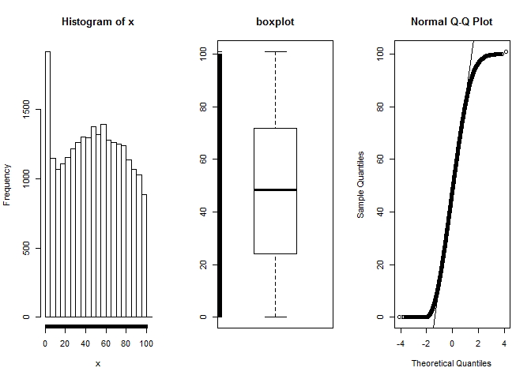
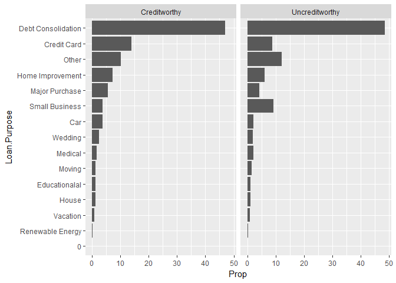
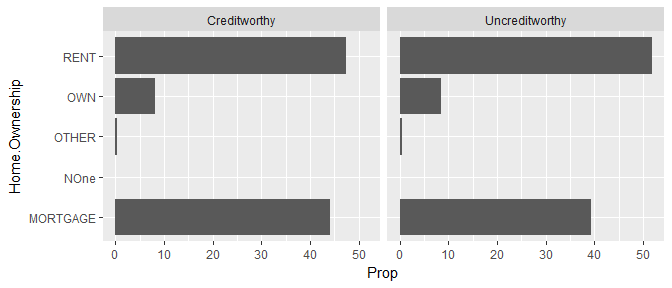
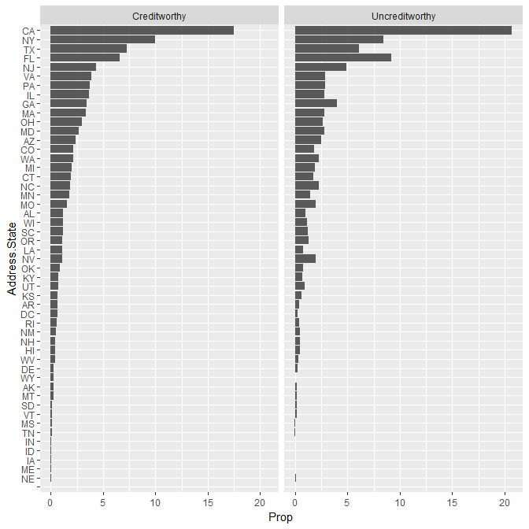
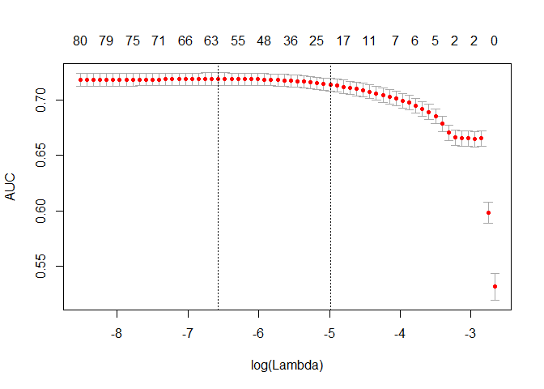
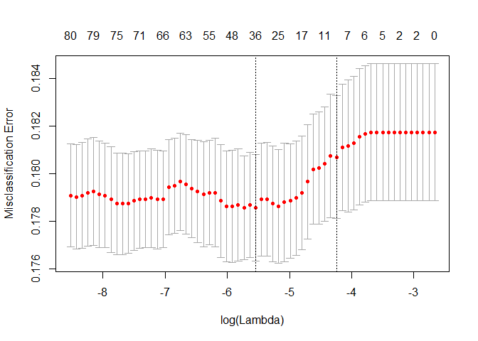
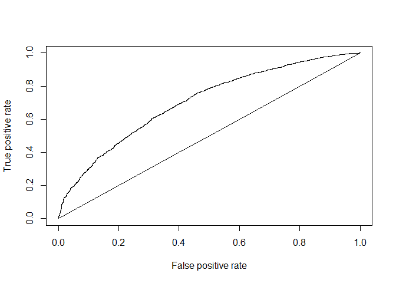

Binary Logistic Regression Predicting Loan Default
================
Nick Howlett
15 December 2016

This report details the analysis and construction of a logistic regression model for predicting loan application success. The data are sourced from: <https://s3-eu-west-1.amazonaws.com/logicalgluebucket/interview/LendingClub.csv>

Data Cleansing and Exploratory Data Analysis \[EDA\]
----------------------------------------------------

The first task is to load the data into R and to examine its nature. In particular it is crucial to understand the nature of the independent variables that will be used to predict loan application success.

### Coarse examination of data

A broad overview of the data set is produced via a convenience function. The data summary is shown below.

``` r
df <- read.csv("LendingClub.csv")

df_sum <- makeDataSummary(df)

kable(df_sum)
```

| Var                               | Class   |  NumLev|  NumNA|  ProcNA|  ProcNum|
|:----------------------------------|:--------|-------:|------:|-------:|--------:|
| Loan.Amount                       | integer |     804|      0|  0.0000|     0.07|
| Loan.Term                         | factor  |       2|      0|  0.0000|     0.83|
| Employment.Length                 | numeric |      12|      0|  0.0000|     0.22|
| Home.Ownership                    | factor  |       5|      0|  0.0000|     0.48|
| Annual.Income                     | numeric |    3615|      0|  0.0000|     0.04|
| Loan.Purpose                      | factor  |      15|      0|  0.0000|     0.47|
| Address.State                     | factor  |      51|      0|  0.0000|     0.18|
| Debt.To.Income.Ratio              | numeric |    2903|      1|  0.0000|     0.01|
| No..Delinquencies.In.Last.2.Years | factor  |      11|      1|  0.0000|     0.89|
| Earliest.Credit.Line.Opened       | numeric |   23843|      0|  0.0000|     0.03|
| FICO.Credit.Score                 | integer |      41|      1|  0.0000|     0.06|
| No..Inquiries.In.Last.6.Months    | integer |      10|      1|  0.0000|     0.45|
| Months.Since.Last.Delinquency     | integer |      89|      0|  0.0000|     0.65|
| No..Of.Credit.Lines               | integer |      43|      1|  0.0000|     0.10|
| No..Adverse.Public.Records        | factor  |       6|      1|  0.0000|     0.95|
| Total.Credit.Balance              | integer |   15483|      1|  0.0000|     0.03|
| Use.Of.Credit.Line                | numeric |    1035|     52|  0.0021|     0.03|
| Total.Number.Of.Credit.Lines      | integer |      81|      1|  0.0000|     0.04|
| Loan.Application.Description      | integer |     993|      0|  0.0000|     0.28|
| No..Of.Public.Record.Bankruptcies | factor  |       3|      0|  0.0000|     0.96|
| Class                             | factor  |       2|      0|  0.0000|     0.82|

The summary table contains six fields; 'Var', 'Class', 'NumLev', 'ProcNA' and 'ProcNum'. 'Var' and 'Class' detail the variable name and class of the variable, 'NumLev' details the number of unique values taken by 'Var' and 'ProcNA'/'ProcNum' detail the proportion of records which are NA and contain the modal value respectively.The data are a mixture of numeric and categorical variables.

### Handling missingness

From the summary table it is seen that missingness isn't a large issue for the data with the most affected variable, 'Use.Of.Credit.Line', missing less than 0.25% of its records. A EDA plotting function is used here to examine the nature of the distribution of this variable.

``` r
simple.eda(df$Use.Of.Credit.Line)
```



Looking at the symmetry of the distribution and considering that only a very small fraction of the values are missing it seems reasonable in this case to impute the mean value for those cases where it is missing.

``` r
df[is.na(df$Use.Of.Credit.Line), "Use.Of.Credit.Line"] <- 
                                       mean(df$Use.Of.Credit.Line, na.rm = TRUE)
```

A few other variables contain one NA which might indicate that one record is missing several values. If this is the case this record should be located and pruned. To search for this record the number of NAs across all columns was calculated as follows.

``` r
df <- df %>% mutate(sumNA = apply(df, 1, function(x) sum(is.na(x))))
```

Upon examination it is found that the record on row 7667 is missing 11 of the 21 dependent variables (9 are NAs and 2 are erroneous entries). Hence this record is removed from the data and any further analyses.

``` r
df <- df[-7667, ]
```

Some further inspection of the variables reveals that some factor variables are actually meant to be numerics; the variables 'No..Delinquencies.In.Last.2.Years', 'No..Adverse.Public.Records', 'No..Of.Public.Record.Bankruptcies' represent numbers (as the names suggest) but the data have been coded as unordered factors "one", "two", etc. To correct for this a function was written and applied to the data.

``` r
# Recoding factor columns into numerics

string.to.num <- function(s) {
  
  s <- tolower(s)
  
  # substituions to be made
  old <- c("none","one", "two", "three", "four", "five",
           "six", "seven", "eight", "nine", "ten")
  new <- c(0:10)

  for(i in seq_along(old)) s <- gsub(old[i], new[i], s, fixed = TRUE)
  
  s <- as.numeric(s)
  
  s 
  
}

df <- df %>%
      mutate(No..Delinquencies.In.Last.2.Years = 
                 string.to.num(No..Delinquencies.In.Last.2.Years),
             No..Adverse.Public.Records = 
                 string.to.num(No..Adverse.Public.Records),
             No..Of.Public.Record.Bankruptcies = 
                 string.to.num(No..Of.Public.Record.Bankruptcies))
```

Below the top 3 factors in terms of level count are examined (note: this is counted after the transformation of the factors to numerics detailed earlier); these factors are the loan purpose, state address, and home ownership.

``` r
## Exploring the factor varibles

# Loan purpose

# Tabulate purposes

df_loanPurpose <- table(df$Loan.Purpose, df$Class) %>% as.data.frame()

names(df_loanPurpose)[1:2] <- c("Loan.Purpose", "Outcome")

# Calculate proptions

df_loanPurpose <- df_loanPurpose %>%
                  group_by(Outcome) %>%
                  mutate(Prop = 100*Freq/sum(Freq),
                         Loan.Purpose = fct_reorder(Loan.Purpose, Prop))

# Create barplot

ggpurp <- ggplot(df_loanPurpose, aes(x = Loan.Purpose, y = Prop)) 
ggpurp <- ggpurp + geom_bar(stat = "identity")
ggpurp <- ggpurp + facet_wrap(~Outcome)
ggpurp <- ggpurp + coord_flip()
ggpurp
```



``` r
# Home ownership

# Tabulate Ownership

df_homeOwnership <- table(df$Home.Ownership, df$Class) %>% as.data.frame()

names(df_homeOwnership)[1:2] <- c("Home.Ownership", "Outcome")

df_homeOwnership <- df_homeOwnership %>%
  group_by(Outcome) %>%
  mutate(Prop = 100*Freq/sum(Freq),
         Home.OwnerShip = fct_reorder(Home.Ownership, Prop))

# Create barplot

gghome <- ggplot(df_homeOwnership, aes(x = Home.Ownership, y = Prop)) 
gghome <- gghome + geom_bar(stat = "identity")
gghome <- gghome + facet_wrap(~Outcome)
gghome <- gghome + coord_flip()
gghome
```



``` r
# State Address

# Tabulate Address 

df_state <- table(df$Address.State, df$Class) %>% as.data.frame()

names(df_state)[1:2] <- c("Address.State", "Outcome")

df_state <- df_state %>%
  group_by(Outcome) %>%
  mutate(Prop = 100*Freq/sum(Freq),
         Address.State = fct_reorder(Address.State, Prop))

# Create barplot

ggstate <- ggplot(df_state, aes(x = Address.State, y = Prop)) 
ggstate <- ggstate + geom_bar(stat = "identity")
ggstate <- ggstate + facet_wrap(~Outcome)
ggstate <- ggstate + coord_flip()
ggstate
```



The above plots illustrate two things. Firstly the overall proportion of the separate levels in each factor; for instance it is seen that "Debt Consolidation" is by far the most popular purpose for the loan, and California is the most frequent State found in the data. Secondly by faceting the plots over the outcome any apparent differences in acceptance for each level is shown; for instance it can be seen that for the 'Small Business' loan purpose there is a larger portion of 'Uncreditworthy' outcomes than 'Creditworthy'.

Overall these plots show that these three factors don't appear to contain a lot of predictive value; for the most part the proportions of the levels are homogeneous over the outcome variable.

### Variable importance

Variables are examined in a univariate manner for their predictive capabilities on the target variable 'Class'.

The target variable is a binary factor which modal value appears in 82% of records. This is useful information as it will reveal the absolute worst case of performance that a model could make; the case where the model always predicts a success or failure (depending on which appears most often). To verify which is the modal value ('Creditworthy' or 'Uncreditworthy') the following code is executed;

``` r
sum(df$Class == "Creditworthy")/nrow(df)
```

    ## [1] 0.8182846

which confirms that loans are accepted in 82% of the data. Hence the null model of always predicting 'Creditworthy' would be correct 82% of the time.

Weight of Evidence \[WoE\] and Information Value \[IV\] are calculated for each variable. When the variable is categorical the WoE is the log-density ratio for each level, where the density refers to the density of target outcomes for each level of the factor. WoE is useful to recode the correlation between a factor level and the target outcome and is often used to substitute the original variable in model building. However WoE can be misleading when the distribution of levels is inhomogeneous. The IV takes into account the total distribution of the target variable over all levels of the factor and serves as a good metric for predictive power.

The outcome variable 'Class' is projected onto a binary flag 'Class\_bin' and using the 'Information' package WoE and IV values are calculated. A summary table is shown below.

``` r
# Project the target variable onto a binary flag
df$Class_binNum <- ifelse(df$Class == "Creditworthy", 1, 0)
df$Class_bin <- as.factor(df$Class_binNum)

# Calculate WoE and IV
df_infotable <- create_infotables(df[ ,setdiff(names(df),
                                       c("Class", "sumNA", "Class_bin"))],
                                       y = "Class_binNum")

kable(df_infotable$Summary)
```

|     | Variable                          |         IV|
|-----|:----------------------------------|----------:|
| 2   | Loan.Term                         |  0.1883109|
| 11  | FICO.Credit.Score                 |  0.1653211|
| 17  | Use.Of.Credit.Line                |  0.1200644|
| 6   | Loan.Purpose                      |  0.0922819|
| 5   | Annual.Income                     |  0.0672703|
| 7   | Address.State                     |  0.0540908|
| 12  | No..Inquiries.In.Last.6.Months    |  0.0425058|
| 8   | Debt.To.Income.Ratio              |  0.0400810|
| 18  | Total.Number.Of.Credit.Lines      |  0.0226000|
| 3   | Employment.Length                 |  0.0193641|
| 1   | Loan.Amount                       |  0.0186575|
| 15  | No..Adverse.Public.Records        |  0.0169235|
| 10  | Earliest.Credit.Line.Opened       |  0.0154134|
| 20  | No..Of.Public.Record.Bankruptcies |  0.0105380|
| 14  | No..Of.Credit.Lines               |  0.0099140|
| 4   | Home.Ownership                    |  0.0099040|
| 19  | Loan.Application.Description      |  0.0093618|
| 16  | Total.Credit.Balance              |  0.0038017|
| 9   | No..Delinquencies.In.Last.2.Years |  0.0018038|
| 13  | Months.Since.Last.Delinquency     |  0.0011922|

The table above shows the IV for each variable. A good rule of thumb for IV is as follows:

| Information.Value | Predictive.Power       |
|:------------------|:-----------------------|
| &lt;0.02          | Useless for Prediction |
| 0.02 to 0.1       | Weak Predictor         |
| 0.1 to 0.3        | Medium Predictor       |
| 0.3 to 0.5        | Strong Predictor       |

It follows that the best predictors in the data are 'Loan.Term', 'FICO.Credit.Score', and 'Use.Of.Credit.Line'. Concerning 'Loan.Term' it is a binary categorical factor recording the term of the loan; either 36 or 60 months. Using WoE we can understand the correlation of this variable with the outcome.

``` r
kable(df_infotable$Tables$Loan.Term)
```

| Loan.Term |      N|    Percent|         WOE|         IV|
|:----------|------:|----------:|-----------:|----------:|
| 36 Months |  20585|  0.8308779|   0.2301186|  0.0408284|
| 60 Months |   4190|  0.1691221|  -0.8312470|  0.1883109|

From the table it can be surmised that there is a negative correlation (negative WoE) with moderate predictive power (IV \(\approx\) 0.2) for the 60 month loan term. To verify this a contingency table is generated.

``` r
kable(table(df$Loan.Term, df$Class_bin))
```

|           |     0|      1|
|-----------|-----:|------:|
| 36 Months |  3087|  17498|
| 60 Months |  1415|   2775|

This contingency table shows that loans of 36 months are accepted with a fraction of \(\frac{17498}{3087 + 17498} = 0.85\), similar to the overall distribution of 0.82 for the entire set. Whereas loans of 60 months are accepted with a fraction of \(\frac{2775}{1415 + 2775} = 0.66\), which is notably lower than the overall distribution. The inference being that 60 month loans are less likely to be accepted than 36 month loans most likely due to the increased risk associated with longer term loan repayment schemes.

From earlier it was seen that the variables 'Address.State' and 'Loan.Purpose' where factors with numerous levels and they rank 6\(^{\textrm{th}}\) and 4\(^{\textrm{th}}\) respectively in terms of IV.

Building a Logistic Regression Model
------------------------------------

In testing it was found that WoE substitution made little difference to model quality and hence for the sake of interpretability the models presented here use the standard variables. Logistic regression models can be built using the 'glmnet' package and is facilitated using functions from the 'caret' package. The algorithms used by glmnet require dummy coding on the variables.

### Data preparation

``` r
#Drop uneeded Levels
df <- droplevels(df)

# Save Outcome
outCome <- df$Class_bin

# Create dummy coded variables


dfDummy <- dummyVars("~.",
                     data = dplyr::select(df,
                                          -Class_bin,
                                          -Class_binNum,
                                          -Class,
                                          -sumNA),
                     fullRank = FALSE)
# Create dummy df
df_dum <- as.data.frame(predict(dfDummy,df))
df_dum$Class_bin <- outCome
levels(df_dum$Class_bin) <- make.names(levels(factor(df_dum$Class_bin)))

# Generalise outcome and predictor names
outcomeName <- 'Class_bin'
predictorsNames <- names(df_dum)[names(df_dum) != outcomeName]

# split data into training and testing chunks
set.seed(1234)
splitIndex <- createDataPartition(df_dum[,outcomeName], p = .70, list = FALSE, times = 1)
df_train <- df_dum[ splitIndex,]
df_test  <- df_dum[-splitIndex,]
```

### Building models

In many use-cases the interpretability of a model can be more important than the raw predictive performance. Variable selection allows for the model to be as simple as possible (i.e. to have as few coefficients for interpretation) while maximising performance.

The glmnet algorithms use the lasso technique for variable selection and regularization. Also, to further mitigate overfitting, the model is validated in a 10-fold cross-validation scheme. For tuning the parameters of the model two optimisation metrics were chosen to see how they effect the model's predictive power; Area Under the ROC Curve \[AUC\], and misclassification rate. Plots of the \(\lambda\)-path on these metrics are shown, where the second (unlabeled) horizontal axis is the effective number of variables in the model as a consequence of the lasso penalty.

``` r
# Build Models
model_glm_auc = cv.glmnet(as.matrix(df_train[,predictorsNames]),
                         df_train[,outcomeName],
                         family="binomial",
                         type.measure = "auc")

plot(model_glm_auc)
```



``` r
model_glm_MCR = cv.glmnet(as.matrix(df_train[,predictorsNames]),
                          df_train[,outcomeName],
                          family="binomial",
                          type.measure = "class")

plot(model_glm_MCR)
```



Interpreting these plots we see the best performing model (indicated by the left-most dashed vertical line) had an AUC of 0.72 for the first model and minimum misclassification error of 0.179. The right-most dashed line shows the model with the highest \(\lambda\) that is within one standard error of the optimum model (typically this model is called the '1-se' model). As this model is evaluated at a larger \(\lambda\) typically this model has few coefficients and is simpler. The optimal AUC model had 54 variables and the 1-se model had 26. The optimal misclassification error model had 24 variables and the 1-se model had 8. Lets examine the predictions made by the 1-se models on the test data.

``` r
predAUC <- predict(model_glm_auc,
                   newx = as.matrix(df_test[ ,predictorsNames]),
                   s = "lambda.1se",
                   type = "class")

predMCR <- predict(model_glm_MCR,
                   newx = as.matrix(df_test[ ,predictorsNames]),
                   s = "lambda.1se",
                   type = "class")

df_test$predAUC <- predAUC
df_test$predMCR <- predMCR


confusionMatrix(df_test$predAUC,
                df_test$Class_bin,
                positive = "X1")
```

    ## Confusion Matrix and Statistics
    ## 
    ##           Reference
    ## Prediction   X0   X1
    ##         X0   52   28
    ##         X1 1298 6053
    ##                                           
    ##                Accuracy : 0.8216          
    ##                  95% CI : (0.8127, 0.8302)
    ##     No Information Rate : 0.8183          
    ##     P-Value [Acc > NIR] : 0.2403          
    ##                                           
    ##                   Kappa : 0.0535          
    ##  Mcnemar's Test P-Value : <2e-16          
    ##                                           
    ##             Sensitivity : 0.99540         
    ##             Specificity : 0.03852         
    ##          Pos Pred Value : 0.82343         
    ##          Neg Pred Value : 0.65000         
    ##              Prevalence : 0.81833         
    ##          Detection Rate : 0.81456         
    ##    Detection Prevalence : 0.98923         
    ##       Balanced Accuracy : 0.51696         
    ##                                           
    ##        'Positive' Class : X1              
    ## 

``` r
confusionMatrix(df_test$predMCR,
                df_test$Class_bin,
                positive = "X1")
```

    ## Confusion Matrix and Statistics
    ## 
    ##           Reference
    ## Prediction   X0   X1
    ##         X0   17    4
    ##         X1 1333 6077
    ##                                           
    ##                Accuracy : 0.8201          
    ##                  95% CI : (0.8112, 0.8288)
    ##     No Information Rate : 0.8183          
    ##     P-Value [Acc > NIR] : 0.3545          
    ##                                           
    ##                   Kappa : 0.0193          
    ##  Mcnemar's Test P-Value : <2e-16          
    ##                                           
    ##             Sensitivity : 0.99934         
    ##             Specificity : 0.01259         
    ##          Pos Pred Value : 0.82011         
    ##          Neg Pred Value : 0.80952         
    ##              Prevalence : 0.81833         
    ##          Detection Rate : 0.81779         
    ##    Detection Prevalence : 0.99717         
    ##       Balanced Accuracy : 0.50597         
    ##                                           
    ##        'Positive' Class : X1              
    ## 

Examining the confusion matrices it is seen that both models perform similarly to each other however overall the performance is not spectacular only providing small boosts to the accuracy over the No Information Rate. At this stage usually a a decision would be made with the stakeholder to establish which business objective this model is hoping to achieve. Does the model want to auto-reject cases where it is certain the credit will not be awarded or auto-accept those where it will?

### Model coefficients and ROC curve

The (non-zero) coefficients for the AUC model and the ROC curve are shown below.

``` r
coef <- round(as.matrix(coef(model_glm_auc, s = model_glm_auc$lambda.1se))[
as.matrix(coef(model_glm_auc, s = model_glm_auc$lambda.1se)) !=0, ], 4) 
coef <- data.frame(names(coef), coef) %>% arrange(desc(coef))
coef
```

    ##                       names.coef.    coef
    ## 1             Loan.Term.36 Months  0.9716
    ## 2                Address.State.WY  0.2491
    ## 3        Loan.Purpose.Credit Card  0.2228
    ## 4                Address.State.LA  0.0794
    ## 5                Loan.Purpose.Car  0.0718
    ## 6               FICO.Credit.Score  0.0073
    ## 7    Total.Number.Of.Credit.Lines  0.0026
    ## 8    Loan.Application.Description  0.0001
    ## 9                     Loan.Amount  0.0000
    ## 10                  Annual.Income  0.0000
    ## 11           Debt.To.Income.Ratio -0.0048
    ## 12             Use.Of.Credit.Line -0.0067
    ## 13               Address.State.NJ -0.0306
    ## 14               Address.State.NV -0.1168
    ## 15     No..Adverse.Public.Records -0.1237
    ## 16 No..Inquiries.In.Last.6.Months -0.1246
    ## 17             Loan.Purpose.Other -0.1593
    ## 18               Address.State.CA -0.1767
    ## 19               Address.State.FL -0.2958
    ## 20    Loan.Purpose.Small Business -0.9360
    ## 21                    (Intercept) -4.3061

``` r
predAUCres <- predict(model_glm_auc,
                      newx = as.matrix(df_test[ ,predictorsNames]),
                      s = "lambda.1se",
                      type = "response")


predObj <- prediction(predAUCres, df_test$Class_bin)

ROC   <- performance(predObj, measure = "tpr", x.measure = "fpr")

plot(ROC);lines(seq(0, 1, 0.1), seq(0, 1, 0.1))
```



From the coefficients it is seen that the most important factors in a credit success are; 36 month loan term, living in Wyoming and having the loan purpose 'Credit Car'. On the other hand the most important factors in credit failure were; having the loan purpose 'Small Business', and living in Florida or California.

Further Work
------------

The performance of the model was not spectacular. The chief limitation are the data themselves. Currently there are no particularly strong predictor variables. In order to improve this model feature engineering could be performed to enrich the feature space of the data. It seems that geographic location, in terms of the State lived in, had a few significant correlations with the target outcome. Potentially the data could be joined to census data to explore if this is actually a manifestation of an underlying combination of socioeconomic predictors. Loan purpose also seemed to show promise, perhaps the current categories could be projected onto a new set which better describes the underlying reasoning for accepting/rejecting a credit application.

It would also be worth training other models such as a Random Forest or Neural Net to see if model performance could not be increased. This would have the downside of losing the interpretability of the model coefficients.
